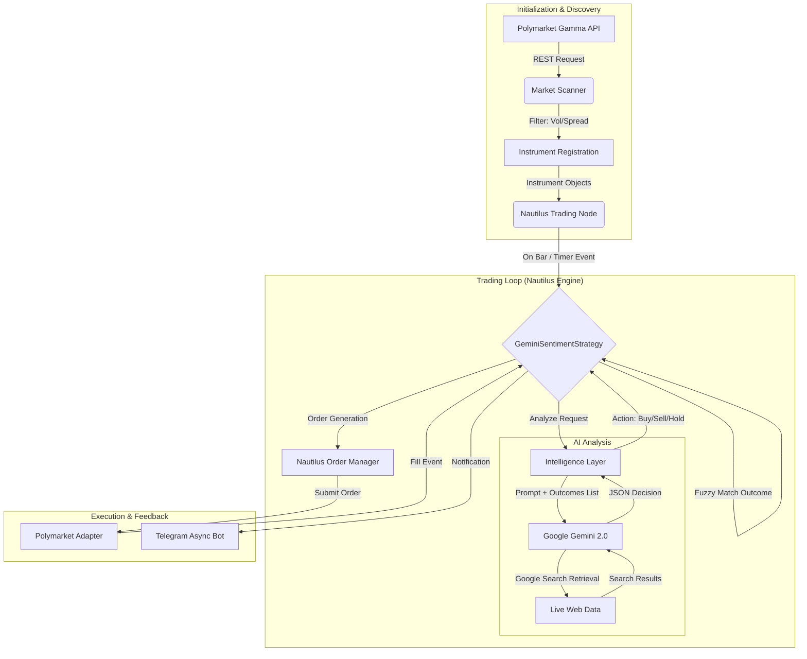

Diese Version dient als "Single Source of Truth" für die Entwicklung.

---

# Polymarket Bot V2 Architecture

Das System ist eine Event-Driven Trading Applikation basierend auf dem **Nautilus Trader Framework**. Es verbindet quantitative Filterung (Scanner) mit qualitativer Analyse durch **Google Gemini 2.0 (Search Grounding)**, um auf Polymarket (Polygon Blockchain) zu handeln.

> **Wichtig:** Diese Architektur nutzt ausschließlich den **offiziellen Nautilus Polymarket Adapter** für Daten und Execution. Es wird keine eigene Web3-Implementierung für das Trading verwendet.

## 🏗 High-Level Übersicht



## 🧩 Kern-Komponenten

### 1. Market Scanner (`src/scanner/polymarket.py`)

Der "Trichter" des Systems. Da Nautilus Instrumente registriert haben muss, bevor es handeln kann, läuft der Scanner initial (und periodisch), um interessante Märkte zu finden.

* **Quelle:** Polymarket Gamma API (REST).
* **Scope:** Unterstützt **Binary** (Ja/Nein) und **Multi-Outcome** Märkte (Sport, Politik, Crypto).
* **Filter-Logik:**
* `min_daily_volume`: Filtert illiquide Märkte.
* `max_spread`: Verhindert hohen Slippage-Einstieg.
* `days_to_expiration`: Fokus auf kurz- bis mittelfristige Events.


### 2. Nautilus Engine & Strategy (`src/strategies/sentiment.py`)

Der Kern der Ausführung. Hier läuft der Event Loop.

* **Klasse:** `GeminiSentimentStrategy`.
* **Taktung:** Nutzt `GenericInstrument` Timer oder Zeit-Checks in `on_bar`, um eine **tägliche Re-Evaluierung** durchzuführen.
* **Active Management:**
* Prüft nicht nur neue Einstiege, sondern bewertet bestehende Positionen neu.
* Führt **Take Profit / Stop Loss** aus, wenn Gemini das Sentiment auf "Sell" ändert.


### 3. Intelligence Layer (`src/intelligence/gemini.py`)

Die Schnittstelle zur KI. Kapselt die Komplexität der Prompts und des Error-Handlings.

* **Search Grounding:** Aktiviert dynamische Google-Suche für aktuelle News.
* **Constraint Generation:** Übergibt dem Modell explizit die Liste der `available_outcomes` (z.B. `["Trump", "Harris", "Other"]`), um Halluzinationen zu verhindern.
* **Fuzzy Matching:** Mappt die Text-Antwort der KI (z.B. "Trump") auf die korrekte interne `InstrumentId` von Nautilus.

### 4. Notification Layer (`src/notifications.py`)

Ein asynchroner "Fire-and-Forget" Service.

* **Technologie:** `aiohttp` oder `aiogram` (non-blocking).
* **Trigger:** Scanner-Funde, Analyse-Entscheidungen (mit Begründung), Order Fills (Entry/Exit).

## 🔄 Data Flow & Decision Logic

### A. Analyse-Prozess (The Gemini Loop)

Jeder Markt wird durch folgenden Prozess geschleust:

1. **Kontext:** Strategie sendet `Question`, `Description` und `List[Outcomes]`.
2. **Grounding:** Gemini sucht aktuelle News zum Thema.
3. **JSON Response:** Das Modell **muss** folgendes Schema liefern:
```json
{
    "action": "buy",           // oder "sell", "hold"
    "target_outcome": "Yes",   // Muss exakt einem String aus der Outcome-Liste entsprechen
    "confidence": 0.85,        // 0.0 bis 1.0
    "reasoning": "Aktuelle Umfragen zeigen einen Anstieg von..."
}

```


### B. Execution Logic

1. **Validierung:** Ist `confidence` > `threshold` (Config)?
2. **Mapping:** `difflib` matcht `target_outcome` auf die `InstrumentId`.
3. **Order:**
* **Entry:** Sendet eine *Marketable Limit Order* (Limit am Ask-Preis), um sofortige Ausführung ohne "Taker"-Slippage Risiko ins Unendliche zu gewährleisten.
* **Größe:** Basiert auf `risk.max_position_size_usdc`.


## 📂 Verzeichnisstruktur (V2)

```text
polymarket_bot/
├── config/
│   ├── config.toml            # Trading Parameter (Risk, Scanner, API)
│   └── catalog.json           # Nautilus Instrument Cache
├── src/
│   ├── data/                  # Loader für historische Daten (Backtesting)
│   ├── intelligence/          # Gemini Wrapper & Prompt Engineering
│   │   └── gemini.py          
│   ├── scanner/               # API Clients für Marktsuche
│   │   └── polymarket.py      # Gamma API Client & Filter
│   ├── strategies/            # Nautilus Strategien
│   │   └── sentiment.py       # Core Logic
│   ├── main.py                # Entry Point (Glue Code)
│   └── notifications.py       # Async Telegram Bot
├── .env                       # Secrets (API Keys)
├── docker-compose.yml         # Container Orchestrierung
└── requirements.txt           # Dependencies

```

## 🛠 Tech Stack

* **Language:** Python 3.11+
* **Trading Engine:** Nautilus Trader (Rust-based Core)
* **AI Model:** Google Gemini 2.0 Flash (via `google-generativeai`)
* **Integration:** Official Polymarket Adapter (`nautilus_trader.adapters.polymarket`)
* **Infrastructure:** Redis (Cache/State), Docker

---

*Zuletzt aktualisiert: Migration Phase V2*
