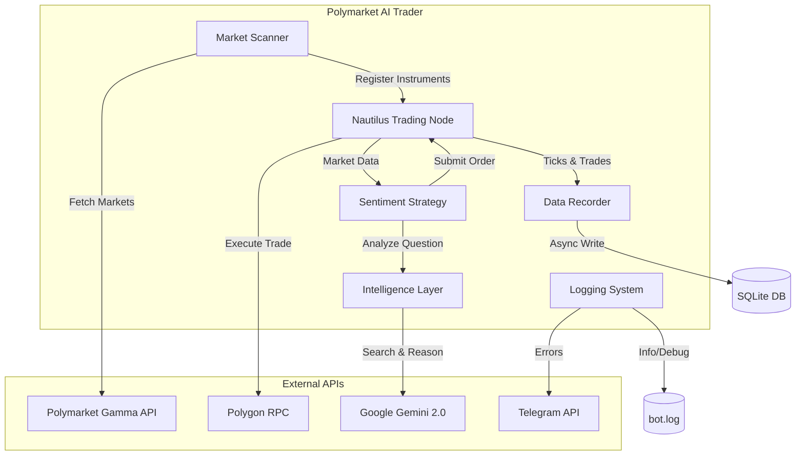

# 🧠 Polymarket AI Trader V2 (Beta)

An event-driven trading system for **Polymarket** (Polygon Blockchain) built on the **Nautilus Trader** framework. This system leverages **Google Gemini 2.0** with Search Grounding for real-time sentiment analysis and executes trades based on fundamental data.

**Key Features:**
*   **Event-Driven Architecture:** Built on Nautilus Trader V2 for robust, low-latency execution.
*   **AI-Powered Sentiment:** Uses Gemini 2.0 Flash to analyze market questions and news, providing structured `buy`/`sell` signals with reasoning.
*   **Smart Scanning:** Automatically finds liquid opportunities on Polymarket via the Gamma API.
*   **Resilient Infrastructure:**
    *   **Dockerized:** Multi-stage build for small images.
    *   **Poetry:** Modern dependency management.
    *   **Logging:** Rotating file logs + Telegram error alerts.
    *   **Database:** Non-blocking SQLite recording with WAL mode.

---

## 🏗 Architecture



---

## 🚀 Getting Started

### Prerequisites

*   **Python 3.11** or **Docker**
*   **Poetry** (for local development)
*   **Polygon Wallet** (Private Key & Address) with POL (Gas) and USDC.e (Collateral).
*   **API Keys:**
    *   Google Cloud (Gemini)
    *   Polymarket (API Key, Secret, Passphrase)
    *   Telegram Bot Token (Optional)

### Installation (Local)

1.  **Clone the repository:**
    ```bash
    git clone https://github.com/philibertschlutzki/polymarket_bot.git
    cd polymarket_bot
    ```

2.  **Install dependencies with Poetry:**
    ```bash
    poetry install
    ```

3.  **Configure Environment:**
    ```bash
    cp .env.example .env
    # Edit .env with your keys
    ```

4.  **Run the Bot:**
    ```bash
    poetry run python src/main.py
    ```

### Installation (Docker)

1.  **Build and Run:**
    ```bash
    docker-compose up -d --build
    ```

2.  **View Logs:**
    ```bash
    docker-compose logs -f bot
    ```

---

## ⚙️ Configuration

The system is configured via `config/config.toml` and environment variables.

**`config.toml` Example:**
```toml
[risk]
max_position_size_usdc = 50.0
slippage_tolerance_ticks = 2

[scanner]
min_daily_volume = 1000.0
max_spread = 0.05
days_to_expiration = 7

[gemini]
model = "gemini-2.0-flash-exp"
temperature = 0.1

[logging]
level = "INFO"
file_path = "logs/bot.log"
```

---

## 📂 Project Structure

```text
polymarket_bot/
├── config/              # Configuration files (TOML)
├── src/
│   ├── data/            # Data recording and loading
│   ├── intelligence/    # LLM integration (Gemini)
│   ├── scanner/         # Market discovery (Gamma API)
│   ├── strategies/      # Nautilus trading logic
│   ├── utils/           # Logging and helpers
│   └── main.py          # Entry point
├── tests/               # Unit tests (pytest)
├── .env.example         # Secrets template
├── Dockerfile           # Multi-stage build definition
├── pyproject.toml       # Poetry dependencies
└── README.md            # Documentation
```

---

## 🧪 Testing

We use `pytest` for unit testing and mocks to avoid live API calls during tests.

```bash
# Run all tests
poetry run pytest

# Run specific test file
poetry run pytest tests/test_strategy.py
```

---

## 🛡 Code Quality

Strict code quality is enforced via CI/CD:
*   **Formatting:** `black`, `isort`
*   **Linting:** `flake8`
*   **Typing:** `mypy --strict`

Run checks locally:
```bash
poetry run black src tests
poetry run isort src tests
poetry run flake8 src tests
poetry run mypy src
```

---

**License:** MIT
**Maintainer:** @philibertschlutzki
