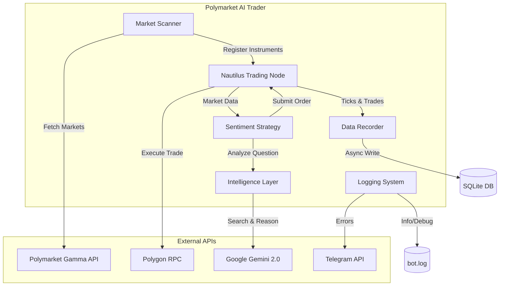

# 🧠 Polymarket AI Trader V2 (Beta)

An event-driven trading system for **Polymarket** (Polygon Blockchain) built on the **Nautilus Trader** framework. This system leverages **Google Gemini 2.0** with Search Grounding for real-time sentiment analysis and executes trades based on fundamental data.

**Key Features:**
*   **Event-Driven Architecture:** Built on Nautilus Trader V2 for robust, low-latency execution.
*   **AI-Powered Sentiment:** Uses Gemini 2.0 Flash to analyze market questions and news, providing structured `buy`/`sell` signals with reasoning.
*   **Smart Scanning:** Automatically finds liquid opportunities on Polymarket via the Gamma API.
*   **Resilient Infrastructure:**
    *   **Dockerized:** Multi-stage build for small images.
    *   **Poetry:** Modern dependency management.
    *   **Logging:** Rotating file logs + Telegram error alerts.
    *   **Database:** Non-blocking SQLite recording with WAL mode.

---

## 🏗 Architecture



---

## 🔄 Dual Deployment Workflow

This repository is designed for a dual workflow to optimize resources:

1.  **VPS (Paper/Live):** The bot runs in `paper` or `live` mode on a low-resource VPS (e.g., 1GB RAM). The `RecorderStrategy` saves real-time market data (Quotes & Trades) to `src/data/market_data.db`.
2.  **Data Transfer:** Periodically copy `market_data.db` from the VPS to your powerful local machine.
3.  **Laptop (Backtest):** Run `src/backtest.py` locally using the recorded data to simulate and improve strategies without risking capital.

---

## 🚀 Installation & Setup

### A. VPS Setup (1GB RAM - Live/Paper)
*Goal: Minimal resource usage, maximum stability.*

**1. Configure Swap (Critical)**
Without swap, the build or runtime might fail on 1GB RAM.
```bash
sudo fallocate -l 2G /swapfile
sudo chmod 600 /swapfile
sudo mkswap /swapfile
sudo swapon /swapfile
echo '/swapfile none swap sw 0 0' | sudo tee -a /etc/fstab
```

**2. Deployment**
```bash
# Install Docker & Git
sudo apt-get update && sudo apt-get install -y docker.io docker-compose git

# Clone Repository
git clone https://github.com/philibertschlutzki/polymarket_bot.git
cd polymarket_bot

# Configure Environment
cp .env.example .env
nano .env
# -> Fill in API Keys. Set GEMINI_MODEL="gemini-2.0-flash"

# Check Config
nano config/config.toml
# -> Ensure mode = "paper" for testing
```

**3. Start System**
```bash
docker-compose up -d --build
# Check Logs:
docker-compose logs -f
```

### B. Laptop Setup (32GB RAM - Backtesting/Dev)
*Goal: Fast development and backtesting.*

**1. Python Environment (Poetry)**
```bash
sudo apt update && sudo apt install python3.11 python3.11-dev build-essential
curl -sSL https://install.python-poetry.org | python3 -

git clone https://github.com/philibertschlutzki/polymarket_bot.git
cd polymarket_bot

# Install Dependencies
poetry env use python3.11
poetry install
```

**2. Transfer Data from VPS**
```bash
# Example (replace user@vps-ip with your details)
scp user@vps-ip:~/polymarket_bot/src/data/market_data.db src/data/
```

**3. Run Backtest**
```bash
poetry run python src/backtest.py
```

**4. Local Paper Trading (Optional)**
```bash
cp .env.example .env
# Configure .env
poetry run python src/main.py
```

---

## ⚙️ Configuration

The system is configured via `config/config.toml` and environment variables.

**`config.toml` Example:**
```toml
[risk]
max_position_size_usdc = 50.0
slippage_tolerance_ticks = 2

[scanner]
min_daily_volume = 1000.0
max_spread = 0.05
days_to_expiration = 7

[gemini]
model = "gemini-2.0-flash"
temperature = 0.1

[logging]
level = "INFO"
file_path = "logs/bot.log"
```

---

## 📂 Project Structure

```text
polymarket_bot/
├── config/              # Configuration files (TOML)
├── src/
│   ├── data/            # Data recording and loading
│   ├── intelligence/    # LLM integration (Gemini)
│   ├── scanner/         # Market discovery (Gamma API)
│   ├── strategies/      # Nautilus trading logic
│   ├── utils/           # Logging and helpers
│   ├── backtest.py      # Backtesting entry point
│   └── main.py          # Live/Paper entry point
├── tests/               # Unit tests (pytest)
├── .env.example         # Secrets template
├── Dockerfile           # Multi-stage build definition
├── pyproject.toml       # Poetry dependencies
└── README.md            # Documentation
```

---

## 🧪 Testing

We use `pytest` for unit testing and mocks to avoid live API calls during tests.

```bash
# Run all tests
poetry run pytest

# Run specific test file
poetry run pytest tests/test_strategy.py
```

---

## 🛡 Code Quality

Strict code quality is enforced via CI/CD:
*   **Formatting:** `black`, `isort`
*   **Linting:** `flake8`
*   **Typing:** `mypy --strict`

Run checks locally:
```bash
poetry run black src tests
poetry run isort src tests
poetry run flake8 src tests
poetry run mypy src
```

---

**License:** MIT
**Maintainer:** @philibertschlutzki
