Hier ist der Entwurf für ein professionelles und vollständiges **README.md**. Es ist so strukturiert, dass es sowohl die Architektur erklärt als auch eine Schritt-für-Schritt-Anleitung für die lokale Entwicklung und das Deployment via Docker (passend zu deiner `docker-compose.yml`) bietet.

Du kannst den folgenden Markdown-Code direkt in deine `README.md` Datei kopieren.

---

```markdown
# 🧠 Polymarket AI Trader (Nautilus & Gemini)


Ein hocheffizienter, KI-gesteuerter Trading-Bot für **Polymarket** (Polygon Blockchain).
Der Bot nutzt das **Nautilus Trader Framework** für professionelles Order-Management und **Google Gemini 2.0 (mit Search Grounding)** für die Sentiment-Analyse von Nachrichten und Ereignissen.

Entwickelt für den Betrieb auf ressourcenbeschränkten Servern (z.B. 1 vCPU, 1 GB RAM).

---

## 🏗 Architektur

Das System besteht aus zwei Hauptkomponenten, die lose gekoppelt sind, um Speicher zu sparen:

1.  **Market Scanner (The Funnel):** Scannt periodisch die Polymarket API nach liquiden Märkten (Volumen > $1k, Spread < 5ct, baldiges Ablaufdatum).
2.  **Trading Engine (Nautilus):** Führt die Handelslogik für die ausgewählten Märkte aus.

```mermaid
graph TD
    A[Polymarket API] -->|Filter: Liquidität & Spread| B(Market Scanner)
    B -->|Kandidaten-Liste| C{Nautilus Strategy}
    C -->|Kontext & Frage| D[Google Gemini 2.0]
    D -->|Google Search Grounding| E[Web Search]
    E --> D
    D -->|Sentiment: Bullish/Bearish| C
    C -->|Order Execution| F[Polymarket CLOB]
    F -->|Fill Notification| G[Telegram Bot]

```



---

## ✨ Features

* **KI-Entscheidungen:** Nutzt Google Gemini 2.0 Flash mit Zugriff auf aktuelle Google-Suchergebnisse (keine Halluzinationen bei aktuellen News).
* **Smart Execution:** Nutzt *Marketable Limit Orders*, um Slippage zu vermeiden, aber Liquidität sofort zu nehmen (Taker).
* **Ressourcenschonend:** Nutzt Redis als reinen In-Memory Cache (keine Disk-Persistenz), ideal für VPS mit wenig IOPS/RAM.
* **Risikomanagement:**
* Harter Cap pro Trade (z.B. max. 50 USDC).
* Kein Pyramiding (Nachkaufen).
* Automatischer Exit bei Sentiment-Wechsel.


* **Monitoring:** Echtzeit-Benachrichtigungen über Telegram (Käufe, Verkäufe, PnL).

---

## 🚀 Installation & Setup

### Voraussetzungen

Du benötigst folgende Accounts und Keys:

1. **Google Cloud:** API Key für Gemini (mit Vertex AI / AI Studio Zugriff).
2. **Polygon Wallet:** Private Key einer Wallet mit etwas POL (für Gas) und USDC.e (für Einsätze).
3. **Polymarket API:** API Key, Secret und Passphrase (erstellbar via Polymarket Profil).
4. **Telegram:** Bot Token (via @BotFather) und deine Chat ID.

### 1. Repository klonen

```bash
git clone [https://github.com/philibertschlutzki/polymarket_bot.git](https://github.com/philibertschlutzki/polymarket_bot.git)
cd polymarket_bot

```

### 2. Konfiguration (.env)

Erstelle eine Datei `.env` im Hauptverzeichnis. **Diese Datei darf niemals auf GitHub hochgeladen werden!**

```bash
cp .env.example .env
nano .env

```

Fülle sie mit deinen Daten:

```ini
# --- Google Gemini ---
GOOGLE_API_KEY="dein_google_api_key"

# --- Polymarket / Polygon ---
POLYGON_PRIVATE_KEY="0x..."
POLYMARKET_API_KEY="dein_api_key"
POLYMARKET_API_SECRET="dein_secret"
POLYMARKET_PASSPHRASE="deine_passphrase"

# --- Telegram Notification ---
TELEGRAM_BOT_TOKEN="123456:ABC-..."
TELEGRAM_CHAT_ID="123456789"

# --- System Settings ---
# Setze dies auf 'production' auf dem Server
APP_ENV="development"

```

### 3. Konfiguration (config.toml)

Passe die Handelsstrategie in `config/config.toml` an:

```toml
[risk]
max_trade_usdc = 50.0       # Maximaler Einsatz pro Wette
min_liquidity_daily = 1000  # Nur Märkte mit >$1k Volumen/Tag
max_spread_cents = 0.05     # Nur Märkte mit engem Spread

[strategy]
re_eval_hours = 24          # Alle 24h Sentiment neu prüfen
confidence_threshold = 0.75 # Gemini muss sich zu 75% sicher sein

```

---

## 🐳 Deployment mit Docker (Empfohlen)

Das Projekt enthält eine `docker-compose.yml`, die den Bot und eine optimierte Redis-Instanz startet.

### Starten

```bash
docker-compose up -d --build

```

Dies startet zwei Container:

1. `redis`: Ein schlanker Cache-Speicher (ohne Festplatten-Persistenz).
2. `polymarket-bot`: Die eigentliche Python-Applikation.

### Logs ansehen

Um zu sehen, was der Bot macht (oder Fehler zu finden):

```bash
# Live Logs verfolgen
docker-compose logs -f polymarket-bot

```

### Stoppen & Update

```bash
# Stoppen
docker-compose down

# Update (nach git pull)
git pull
docker-compose up -d --build

```

---

## 🛠 Lokale Entwicklung (Ohne Docker)

Für Backtesting oder Strategie-Entwicklung auf deinem Laptop:

1. **Python Environment erstellen:**
```bash
uv venv .venv  # oder python -m venv .venv
source .venv/bin/activate

```


2. **Abhängigkeiten installieren:**
```bash
uv pip install -r requirements.txt

```


3. **Bot starten:**
Du benötigst einen laufenden Redis-Server lokal oder musst die Config anpassen.
```bash
python src/main.py

```


---

## 📂 Projektstruktur

```text
polymarket_bot/
├── config/
│   ├── config.toml          # Strategie-Parameter
│   └── catalog.json         # Nautilus Instrument Katalog
├── src/
│   ├── data/                # Loader für historische Daten (SQLite)
│   ├── intelligence/        # Gemini API Wrapper & Prompts
│   ├── scanner/             # Polymarket API Filter (Der Trichter)
│   ├── strategies/          # Nautilus Strategy Klassen
│   └── main.py              # Entry Point
├── docker-compose.yml       # Docker Orchestrierung
├── Dockerfile               # Image Definition
├── requirements.txt         # Python Libraries
└── README.md                # Dokumentation

```

---

## ⚠️ Disclaimer & Risiko

Dieser Bot handelt mit echtem Geld (Kryptowährungen).

* **Benutzung auf eigene Gefahr.**
* Die KI (Gemini) kann Fehler machen oder Nachrichten falsch interpretieren.
* Vergangene Performance im Backtest garantiert keine zukünftigen Gewinne.
* Stelle sicher, dass du die `max_trade_usdc` Limits entsprechend deiner Risikotoleranz setzt.

---

**Lizenz:** MIT
**Maintainer:** @philibertschlutzki

```

```
