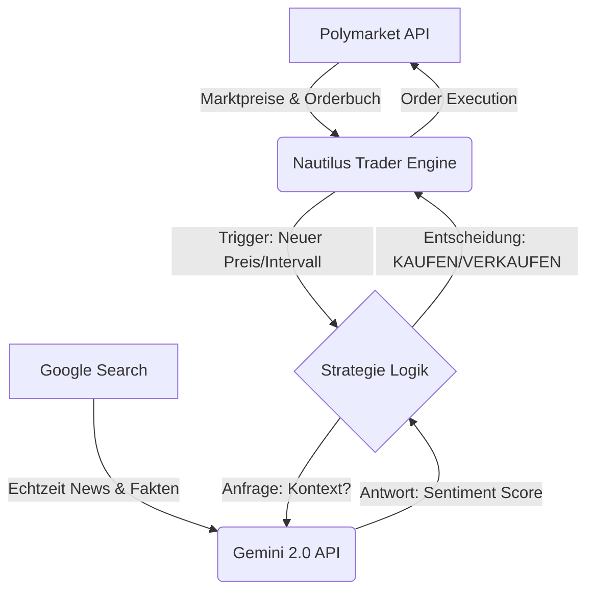

Das ist ein sehr solider Plan. Die Wiederverwendung des bestehenden Repositories ist sinnvoll, um die Historie zu bewahren, aber wir müssen eine saubere Trennung ("Housekeeping") durchführen, damit sich die alten Skripte nicht mit der neuen Nautilus-Architektur vermischen.

Da du **Swing-Trading** (Stunden/Tage) betreibst und **Gemini mit Google Search** ("Grounding") nutzt, sinkt die Last auf dem Server drastisch, da wir nicht im Millisekunden-Takt Orderbuch-Updates verarbeiten müssen. Das macht den 1GB-RAM-Server deutlich überlebensfähiger.

Hier ist das vollständig überarbeitete **Architecture & Deployment Design Dokument**, bereit für dein Repository.

---

### Datei: `ARCHITECTURE.md`

Du kannst diesen Inhalt direkt in dein Repository kopieren.

```markdown
# Nautilus Trader & Polymarket Integration (V2)

## 1. Projekt-Status & Zielsetzung
Dieses Repository wird von einer eigenständigen Bot-Lösung auf das professionelle **Nautilus Trader Framework** migriert.
* **Legacy Code:** Alte Skripte wurden archiviert (siehe `/legacy_v1`).
* **Neue Engine:** Nautilus Trader (Rust/Python Core).
* **Strategie:** Sentiment-Analyse basierend auf Google Gemini 2.0 (mit Google Search Grounding).
* **Handelsfrequenz:** Swing-Trading (Stundenbasis/Event-Driven).

## 2. System-Architektur

### Datenfluss


### Komponenten

1. **Nautilus Host:** Der Trading-Kernel, der die Verbindung zur Blockchain/API hält.
2. **Strategy Node:** Python-Klasse, die Marktdaten empfängt.
3. **Intelligence Layer:** Eine Integration der `google-generativeai` Bibliothek. Wir nutzen das "Grounding" Feature, damit das Modell aktuelle Suchergebnisse in die Bewertung einbezieht (keine Halluzinationen über veraltete Ereignisse).

---

## 3. Repository Struktur (Migration)

Wir strukturieren das Repo um, damit der neue Bot sauber läuft:

```text
polymarket_bot/
├── .github/
│   └── workflows/
│       └── deploy.yml          # CI/CD: Auto-Deploy auf Server bei Push
├── legacy_v1/                  # ARCHIV: Dein alter Bot code (verschoben)
├── nautilus_v2/                # NEU: Das Nautilus Projekt
│   ├── config/
│   │   ├── config.toml         # Hauptkonfiguration (Ohne Secrets!)
│   │   └── catalog.json        # Daten-Katalog (Instrumente)
│   ├── strategies/
│   │   ├── sentiment.py        # Die Gemini-Logik
│   │   └── parsing.py          # Helper für Polymarket Slugs
│   ├── main.py                 # Einstiegspunkt (Launcher)
│   └── run_backtest.py         # Skript für lokale Tests
├── .gitignore                  # WICHTIG: Ignoriert .env und /data
├── .env.example                # Template für API Keys
├── requirements.txt            # Abhängigkeiten (nautilus_trader, google-genai)
└── README.md

```

---

## 4. Development Workflow (Local: Ubuntu Laptop)

Da Nautilus komplex ist, findet die Logik-Entwicklung **lokal** statt.

**Voraussetzungen:**

* Python 3.11+
* `uv` (empfohlener Package Manager für Speed)
* Google Cloud API Key (mit Vertex AI oder Studio Berechtigung)

**Schritte:**

1. **Setup:**
```bash
uv venv .venv
source .venv/bin/activate
uv pip install -r requirements.txt

```


2. **Backtesting (Mock Search):**
Da wir historische News schwer googeln können, nutzen wir für Backtests entweder statische News-Daten oder führen "Forward Testing" (Papertrading in Echtzeit) durch.
3. **Commit & Push:**
Wenn die Strategie lokal keine Syntaxfehler wirft -> Push zu GitHub.

---

## 5. Deployment Workflow (Cloud: Ubuntu Server)

Der Server (1 vCPU, 1 GB RAM) dient nur der Ausführung. Er kompiliert nichts.

### A. Server Vorbereitung (Einmalig)

Da 1 GB RAM knapp ist, **muss** Swap aktiviert werden:

```bash
# 2GB Auslagerungsdatei erstellen
sudo fallocate -l 2G /swapfile
sudo chmod 600 /swapfile
sudo mkswap /swapfile
sudo swapon /swapfile
echo '/swapfile none swap sw 0 0' | sudo tee -a /etc/fstab

```

### B. Automatisierung via GitHub Actions

Wir nutzen eine Action, die sich per SSH verbindet und den Bot aktualisiert.

**Geheimnisse (GitHub Secrets) zu setzen:**

* `HOST`: IP-Adresse des Servers
* `USERNAME`: Dein SSH User
* `SSH_PRIVATE_KEY`: Dein Private Key
* `ENV_FILE`: Der Inhalt der `.env` Datei (Damit Secrets nie im Code stehen, werden sie beim Deploy injiziert).

**Der Prozess:**

1. Push auf `main`.
2. GitHub Action loggt sich per SSH ein.
3. `git pull` im Repo Ordner.
4. Aktualisiert `.env` aus den Secrets.
5. Startet den SystemD Service neu (`systemctl restart polymarket-nautilus`).

---

## 6. Gemini Integration Details

Wir nutzen das `google-generativeai` SDK.

**Strategie-Logik (Pseudocode):**

```python
model = GenerativeModel('gemini-2.0-flash')

def get_sentiment(question, current_price):
    # Nutzung des integrierten Google Search Tools
    response = model.generate_content(
        f"Recherchiere aktuelle News zu: '{question}'. "
        f"Der Marktpreis impliziert eine Wahrscheinlichkeit von {current_price*100}%. "
        f"Gibt es neue Informationen, die diesen Preis stark widersprechen?",
        tools='google_search_retrieval' # Aktiviert Grounding
    )
    return response.text # Parsing der Antwort in Trading-Signal

```

```

---

### Nächste Schritte für dich

Damit wir starten können, müssen wir die Migration durchführen.

1.  **Lokal aufräumen:**
    * Erstelle in deinem lokalen Ordner den Ordner `legacy_v1`.
    * Verschiebe **alle** bisherigen Dateien dort hinein (außer `.git`).
    * Erstelle den Ordner `nautilus_v2`.

2.  **SSH Key für GitHub erstellen:**
    Damit die GitHub Action auf deinen Server zugreifen kann, brauchst du ein SSH-Key-Paar speziell für GitHub.
    * Soll ich dir die Anleitung geben, wie du das sicher generierst und bei GitHub hinterlegst?

3.  **Google Cloud Projekt:**
    Hast du bereits einen API Key für Gemini, der **Google Search Grounding** aktiviert hat? (Das ist oft ein separates Häkchen in der Google AI Studio Konsole oder via Vertex AI).

### Soll ich dir als nächstes die `requirements.txt` und das `migrate.sh` Skript erstellen, damit du die Ordnerstruktur schnell sauber bekommst?

```