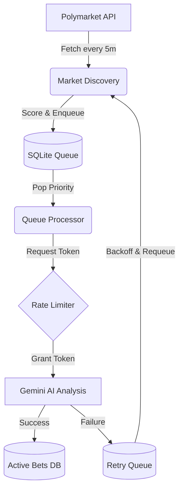

# Polymarket Bot - Continuous Processing Architecture

## Overview

The Polymarket Bot v2.0 introduces a **continuous stream-processing architecture** to replace the previous 15-minute batch cycle. This shift addresses API rate limiting issues (Gemini 429 errors) and improves market coverage by distributing requests evenly over time.

## Core Concepts

### 1. Continuous Stream Processing
Instead of analyzing 15 markets in a burst every 15 minutes, the bot now analyzes 1 market approximately every 15 seconds. This "smooth" processing eliminates spikes in API usage.

### 2. Multi-Threaded Workers
The system runs four independent daemon threads:

*   **Market Discovery Worker**: Fetches new markets from Polymarket API every 5 minutes and adds them to a persistent queue.
*   **Queue Processing Worker**: The core engine. Pops markets from the queue, waits for a rate limit token, and performs AI analysis.
*   **Health Monitoring Worker**: Tracks memory usage, API performance, and queue statistics. Updates dashboards.
*   **Resolution Worker**: Checks for expired bets and resolves them (legacy logic, running in background).

### 3. Adaptive Rate Limiting
A **Token Bucket** algorithm controls API request frequency.
*   **Target RPM**: 4 requests per minute (safe buffer for 5 RPM limit).
*   **Adaptive Behavior**: If a 429 error occurs, the RPM is immediately halved (e.g., 4 -> 2) and an extended backoff is triggered. RPM gradually recovers after successful requests.

### 4. Persistent Queue
An SQLite-backed queue (`data/queue.db`) decouples market fetching from analysis.
*   **Priority Scheduling**: High-value markets (based on volume and price edge) are processed first.
*   **Retry Logic**: Failed markets move to a retry queue with exponential backoff (60s -> 1h).

## Data Flow

## Components

### AdaptiveRateLimiter (`src/adaptive_rate_limiter.py`)
Manages the token bucket.
*   `acquire_token(block=True)`: Blocks execution until a token is available.
*   `report_429_error()`: Triggers aggressive backoff and RPM reduction.
*   `report_success()`: Gradually restores RPM.

### QueueManager (`src/market_queue.py`)
Manages SQLite tables:
*   `market_queue`: Pending and processing markets.
*   `retry_queue`: Failed markets waiting for retry.
*   `queue_history`: Audit log of queue operations.

### HealthMonitor (`src/health_monitor.py`)
Tracks vital statistics:
*   **Memory**: Monitors RSS usage to prevent OOM kills (Alert > 400MB).
*   **API**: Tracks RPM, success rate, and backoff status.
*   **Output**: Generates `HEALTH_STATUS.md`.

## Database Schema

### `market_queue`
| Column | Type | Description |
|--------|------|-------------|
| market_slug | TEXT | Primary Key |
| priority_score | REAL | 0.0 - 1.0 (Higher is better) |
| status | TEXT | 'pending', 'processing', 'completed', 'failed' |
| added_at | TIMESTAMP | Creation time |

### `retry_queue`
| Column | Type | Description |
|--------|------|-------------|
| market_slug | TEXT | Primary Key |
| failure_count | INTEGER | Number of failed attempts |
| next_retry_at | TIMESTAMP | When to retry |
| error_type | TEXT | Reason for failure |

## Configuration

Key environment variables:
*   `GEMINI_RPM_INITIAL`: Target RPM (default 4).
*   `QUEUE_SIZE_LIMIT`: Max markets in queue (default 100).
*   `MARKET_FETCH_INTERVAL_MINUTES`: Discovery frequency (default 5).
*   `MEMORY_WARNING_MB`: Memory alert threshold (default 400).
